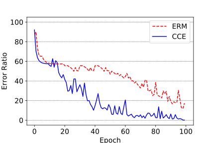
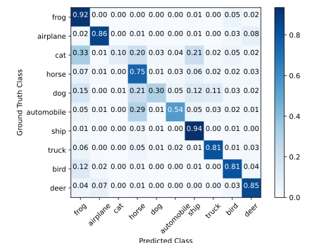

# Imbalanced Image Classification with Complement Cross Entropy (Pytorch)
**[Yechan Kim](github.com/unique-chan), [Yoonkwan Lee](github.com/brightyoun), and [Moongu Jeon](https://scholar.google.co.kr/citations?user=zfngGSkAAAAJ&hl=ko&oi=ao)**

Under Construction! Don't fork yet please!!!

[Cite this Paper]()

## This repository contains:
- Training code for image classification
	- You can use your **own custom datasets**.
	- You can use your **own CNN models**.
	- You can try to use various **loss functions** given.
		- `CCE`: Complement Cross Entropy (**proposed loss function**)
		- `ERM`: Cross Entropy
		- `COT`: Cross Entropy and Complement Entropy (for Complement Objective Training)
		- `FL`: Focal Loss
	- You can visually check the training process with **tensorboard**.
		- **accuracy** and **loss** for training and validation
- Evaluation code for image classification
	- You can test **the trained model** after training.
	- You can visually check the evaluation result with **confusion matrix**.

## Prerequisites
- For training code:
    * `Python 3.7`
    * `PyTorch >= 1.4`
    * `torchvision`
    * `tensorboard`
- For evaluation code:
    * `Python 3.7`
    * `PyTorch >= 1.4`
    * `scikit-learn >= 0.23.2`
    * `torchvision`
    * `matplotlib`

## How to use
1. Before training, you first put your own dataset(s) under the folder, **a_datasets**. The directory structure should be as follows.
~~~
|—— 📁 a_datasets 
	|—— 📁 your_own_splitted_dataset_1
		|—— 📁 train
			|—— 📁 class_1
				|—— 🖼️ 1.jpg
				|—— ...
			|—— 📁 class_2 
				|—— 📁 ...
		|—— 📁 valid
			|—— 📁 class_1
			|—— 📁 ... 
		|—— 📁 test
			|—— 📁 class_1
			|—— 📁 ... 
	|—— 📁 your_own_splitted_dataset_2
	|—— 📁 ...
~~~

1. (Optional) If your own dataset are not splitted into 3 subdirectories (train / valid / test), you can use `data_split.py`, where you should set train / valid / test **split ratio**. Please first put your own dataset under the folder, **c_original_dataset** as follows. The splitted dataset will be stored in **a_datasets**.
~~~
|—— 📁 c_original_dataset
	|—— 📁 your_own_dataset
		|—— 🖼️ 1.jpg
        |—— 🖼️ 2.jpg
        |—— ...
~~~

1. Run **1_train.py** for training. You can use **3_run.sh** for setting various training plans. The below is an example.
~~~
python ./1_train.py --dataset=your_own_splitted_dataset_1 --model_index=36 --objective='ERM' --warmup;
python ./1_train.py --dataset=your_own_splitted_dataset_2 --model_index=35 --objective='CCE' --warmup --ccegamma=1;
python ./1_train.py --dataset=your_own_splitted_dataset_3 --model_index=38 --objective='FL' --warmup;
python ./1_train.py --dataset=your_own_splitted_dataset_4 --model_index=37 --objective='COT' --warmup;
~~~

- Arguments for run 1_train.py:

| Argument | Type | Help | Default | Remarks |
|----------|------|------|---------|---------|
|model_index|int|||You can add and use your own model by modifying **get_model.py**.|
|dataset|str|select the dataset in a_datasets|| |
|objective|str|loss function|'ERM'|You can add and use your own loss function by modifying **criterion.py.**|
|lr|float|initial learning rate|0.1||
|epochs|int||200||
|batchsize|int||128||
|height|int|image height|32||
|width|int|image width|32||
|lrstep|list|manual learning rate decay steps|[60, 60, 40, 40]|recommended|
|warmup||if you want to use linear learning rate warm up for first 5 epochs, use ``--warmup``.|None|recommended|
|ccegamma|int|gamma value for ``CCE``.|5|||

- All training results such as trained parameters file(`.pth`), log files(`.csv` ) will be stored as the following structure.
	
~~~
|—— 📁 logs 
	|—— 📁 ResNet34 (Used CNN Name)
		|—— 📁 cifar-100-balanced (Used Dataset Name)
			|—— 📁 ERM (Used Loss Function Name)
				|—— 📁 2020-08-01-03-30-26 (Start Time of Training)
					|—— 60.87.pth (Trained Parameters File)
                    |—— train.csv (Log for Training)
                    |—— valid.csv (Log for Validation)
                    |—— event files for tensorboard summary
	|—— 📁 ...
~~~

- In `60.87.pth`, 60.87 represents the maximum of prediction accuracy on validation.
- `train.csv` and `valid.csv` include **loss, acc, top5acc, lr (learning rate)** per each epoch during training. 
- You can use these files later for visualization such as plotting validation accuracy per each epoch.
	
1. Run **2_test.py** for evaluation. You can use **3_run.sh** for setting various testing plans. The below is an example.
~~~
python ./2_test.py --dataset=your_own_splitted_dataset_1 --model_index=36 --objective='ERM' --datetime='2020-08-10-22-06-19';
~~~

- Arguments for run 2_test.py:

| Argument | Type | Help |Remarks |
|----------|------|------|---------|
|model_index|int|select the model you used||
|dataset|str|select the dataset you used||
|objective|str|loss function you used||
|datetime|str|start time of your training with given condition (`model_index`, `dataset`, and `objective`).|formatting should be like this: `YYYY-MM-DD-HH-MM-SS`|

- All evaluation result, confusion matrix figure(`.svg`) will be stored as the following structure.
	
~~~
|—— 📁 logs 
	|—— 📁 ResNet34 (Used CNN Name)
		|—— 📁 cifar-100-balanced (Used Dataset Name)
			|—— 📁 ERM (Used Loss Function Name)
				|—— 📁 2020-08-01-03-30-26 (Start Time of Training)
					|—— ...
                    |—— confusion_matrix.svg
	|—— 📁 ...
~~~

## Quick Features of This Code
1. During training with `1_train.py`, tensorboard shows the progress of training.

~~~
tensorboard --logdir=logs
~~~

	

2. After training with `1_train.py`, you can plot the prediction accuracy figure using generated `valid.csv`. (The below is plotted with matplotlib.)

	

2. With `2_test.py`, you can evaluate the trained model. And it also generates the confusion matrix for comparison with other models.

	

## Contribution
If you find any bugs or have opinions for further improvements, please feel free to create a pull request. All contributions are welcome.

## Reference
1. Hao-Yun Chen, Pei-Hsin Wang, Chun-Hao Liu, Shih-Chieh Chang, Jia-Yu  Pan,  Yu-Ting  Chen,  Wei  Wei,  and  Da-Cheng  Juan.   Complementobjective training.arXiv preprint arXiv:1903.01182, 2019.
2. Tsung-Yi Lin, Priya Goyal, Ross Girshick, Kaiming He, and Piotr Doll ́ar.Focal  loss  for  dense  object  detection.InProceedings  of  the  IEEEinternational conference on computer vision, pages 2980–2988, 2017.
3. Tong He, Zhi Zhang, Hang Zhang, Zhongyue Zhang, Junyuan Xie, andMu Li.  Bag of tricks for image classification with convolutional neuralnetworks.  InProceedings of the IEEE Conference on Computer Visionand Pattern Recognition, pages 558–567, 2019.
4. https://github.com/calmisential/Basic_CNNs_TensorFlow2
5. https://github.com/Hsuxu/Loss_ToolBox-PyTorch
6. https://github.com/unique-chan/pytorch-cifar100
